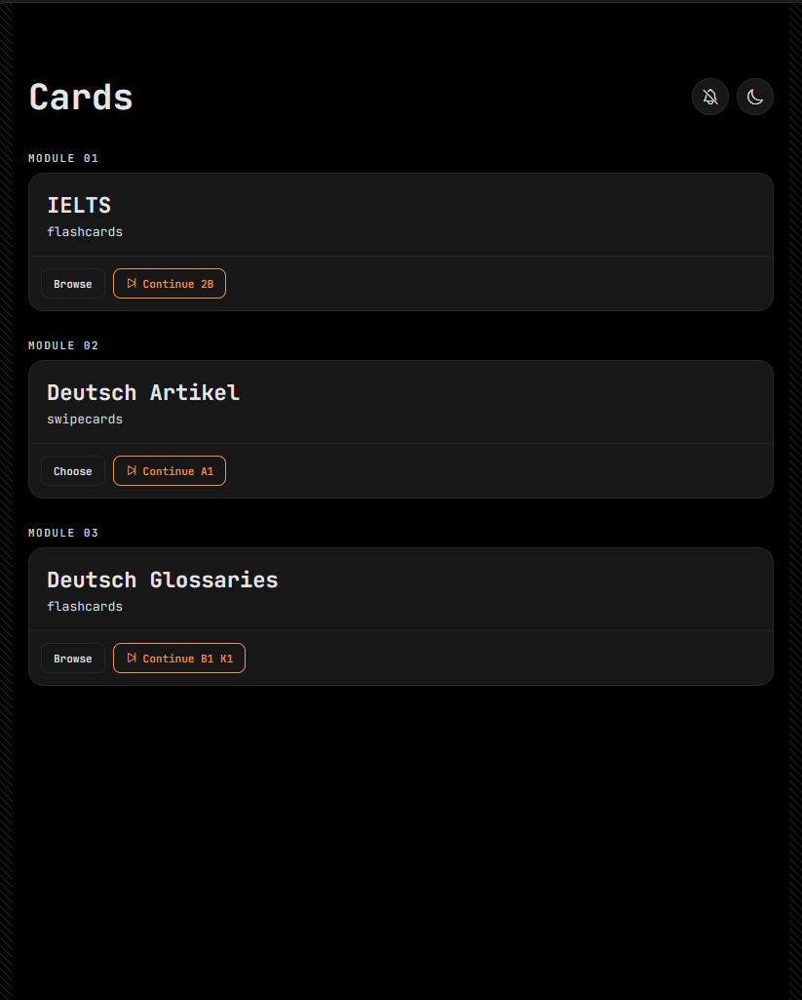

# Cardsssss

This is the web version of [Cardsssss](https://github.com/PembaSrpa/Cardsssss), a mobile app for iOS and Android.
Learn vocabulary in short, tappable bursts. IELTS words, German der/die/das, and German course glossaries.

---

## The Idea

Vocabulary lists are easy to open once and never again. Cards keeps the loop small: pick a topic, flip or swipe through a stack of words, close the tab.

Three modules live side by side because they train different muscles - IELTS is recognition and recall, German articles are pattern instinct, and Glossaries turn a textbook's word list into something you actually review. All three use the same swipeable, thumb-friendly card format, and work the same way whether you're using a trackpad, a mouse, or a touchscreen.

---

## What You'll See

| Module           | Format                                          | What it trains                        |
| ---------------- | ------------------------------------------------ | -------------------------------------- |
| IELTS Vocabulary | Flip cards, grouped by topic and section        | Word meaning, usage, recall           |
| Deutsch Artikel  | Swipe cards (left / right / down)               | Instinct for _der_ / _die_ / _das_    |
| Deutsch Glossar  | Flip cards, grouped by course level and Kapitel | Vocabulary from a specific coursebook |

**IELTS Vocabulary** - pick a Section (Core Academic Vocabulary, Trend & Data Language, Topic-Specific Modules, or Structural & Idiomatic Language), then a category within it, then browse the word list before diving in. Flip a card to reveal the meaning, and move through the stack by swiping/dragging the card or with the prev/next buttons.

**Deutsch Artikel** - a German noun appears with its English meaning underneath; swipe (drag with a mouse or finger) to guess the article and get instant right/wrong feedback. The three swipe directions are colour-coded - _der_ in blue, _die_ in red, _das_ in green - so the colour association builds up before you've even guessed right. Levels run A1 → B1, with an accuracy percentage shown once you've started a level.

**Deutsch Glossar** - browse by course level (A1, A2, B1, B2) and then by Kapitel. B2 splits each Kapitel into four smaller modules first. Every card shows a word, its plural where relevant, the meaning, and an example sentence when the source material has one.

---

## Progress

Your position is saved automatically as you go - per section for IELTS, per level for Deutsch Artikel (along with score and streak), and per Kapitel (or module, for B2) in Deutsch Glossar. Come back later and each module's home card offers a "Continue" shortcut straight back to the exact word you left on.

Progress is stored in your browser (`localStorage`), so it's local to whichever browser and device you're using - there's no account and nothing syncs across devices.

Light and dark themes are both supported, and switch instantly from the toggle in the top bar.

---

## Feedback

If you have any questions, comments, or suggestions, please [email me](mailto:nirashanichang@gmail.com).